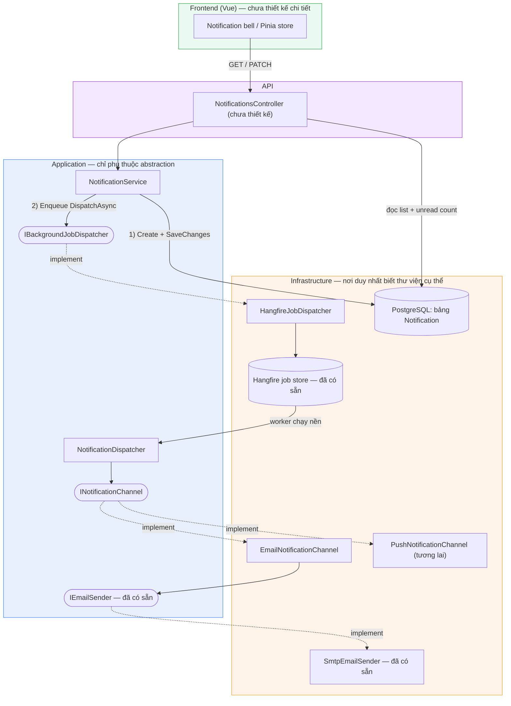
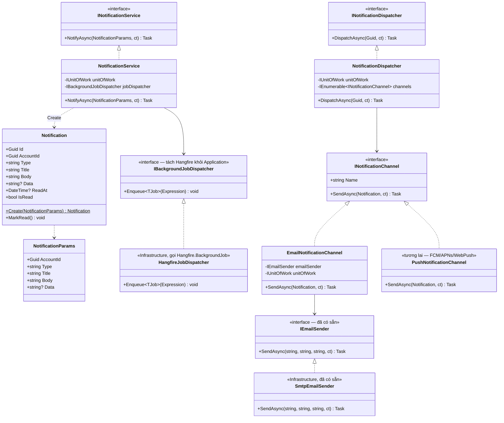
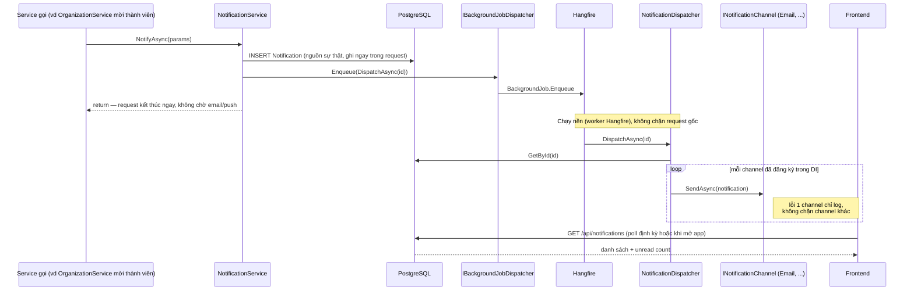
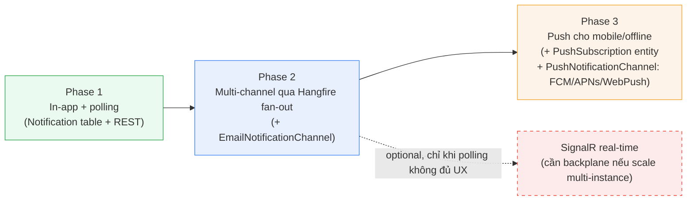

# Kiến trúc module Notification

## Context

Hiện repo **chưa có hệ thống notification** theo nghĩa "trung tâm thông báo" — chỉ có 2 thứ rời rạc:

- `IEmailSender`/`SmtpEmailSender` (`backend/src/StarterKit.Infrastructure/Services/Email/`) — gửi email giao dịch (verify-email), gọi trực tiếp từ auth flow, không qua bất kỳ lớp notification nào.
- `frontend/src/lib/feedback.ts` — toast UI thuần client-side (naive-ui), không persist, không liên quan tới sự kiện phía backend.

Tài liệu này chốt kiến trúc cho một module Notification thật sự: có lưu trữ, có nhiều kênh gửi (in-app, email, và mở rộng được sang push cho mobile/khi app không mở), tận dụng hạ tầng đã có (Postgres, EF Core, Hangfire) thay vì thêm dependency mới ngay từ đầu.

**Nguyên tắc dẫn dắt thiết kế:**

1. Entity Pattern chuẩn của repo (`private ctor` + `Create(Params)` + mutator nhỏ) — theo mẫu `RefreshToken`/`EmailVerificationToken`, không có `Update` chung chung.
2. Clean Architecture: Application **không** được reference trực tiếp thư viện của Infrastructure (Hangfire, MailKit...) — chỉ biết interface do chính Application định nghĩa. Đây là lý do có `IBackgroundJobDispatcher` thay vì gọi thẳng `Hangfire.BackgroundJob.Enqueue`.
3. Bảng `Notification` trong Postgres luôn là **nguồn sự thật** (in-app), các kênh khác (email, push) chỉ là "hint" gửi thêm, chạy nền qua Hangfire, không chặn request gốc và không được phép là nơi duy nhất giữ dữ liệu.

---

## 1. Kiến trúc tổng quan (theo layer)

**Đọc biểu đồ**: mũi tên liền = gọi trực tiếp (đồng bộ, trong cùng request); mũi tên chấm `-.implement.->` = quan hệ interface → implementation (DI). Mọi thứ trong khung `APP` chỉ trỏ vào khung interface (hình oval), không bao giờ trỏ thẳng vào một class cụ thể trong khung `INFRA`.

---

## 2. Class diagram (interface & implementation)

---

## 3. Sequence diagram — luồng chạy thực tế

---

## 4. Data model (sơ bộ)

| Cột | Kiểu | Ghi chú |
|---|---|---|
| `Id` | `uuid` (v7) | PK |
| `AccountId` | `uuid` | FK → `Account`, người nhận |
| `Type` | `string` | Hằng số catalog (vd `OrgInviteReceived`) — dùng để routing channel/preference sau này |
| `Title` | `string` | Tiêu đề hiển thị — **cần nguồn localize vi/en**, xem mục Open Questions |
| `Body` | `string` | Nội dung |
| `Data` | `string?` (jsonb) | Payload nhỏ để frontend deep-link, vd `{"organizationId":"..."}` |
| `ReadAt` | `datetime?` | null = chưa đọc; `IsRead` suy ra từ cột này |
| `CreatedAt`/`UpdatedAt`/`CreatedBy`/`UpdatedBy` | — | kế thừa `BaseEntity<Guid>` |

---

## 5. Lộ trình mở rộng (không làm hết trong 1 lần)

Phase 3 (push) là câu trả lời cho trường hợp "user không mở app/web": backend không giữ kết nối tới thiết bị, mà gọi API của FCM/APNs/Web Push — các hãng này đánh thức thiết bị ở tầng OS ngay cả khi app đã bị kill. Bảng `Notification` vẫn là nguồn sự thật; push chỉ là "hint" kèm theo, không đảm bảo tin cậy/thứ tự.

---

## 6. File/layer placement

| File | Layer | Ghi chú |
|---|---|---|
| `Domain/Entities/Notification.cs` | Domain | `Notification` + `NotificationParams`, theo mẫu `RefreshToken` |
| `Application/Common/Interfaces/INotificationChannel.cs` | Application | Cạnh `IEmailSender` |
| `Application/Common/Interfaces/IBackgroundJobDispatcher.cs` | Application | Trừu tượng hoá Hangfire |
| `Application/Services/Notifications/INotificationService.cs` + `NotificationService.cs` | Application | Persist + enqueue, giống `OrganizationService` |
| `Application/Services/Notifications/INotificationDispatcher.cs` + `NotificationDispatcher.cs` | Application | Loop qua `IEnumerable<INotificationChannel>` |
| `Infrastructure/Services/Notifications/EmailNotificationChannel.cs` | Infrastructure | Wrap `IEmailSender` có sẵn, không sửa nó |
| `Infrastructure/Services/Notifications/PushNotificationChannel.cs` | Infrastructure | Phase 3 |
| `Infrastructure/Services/Jobs/HangfireJobDispatcher.cs` | Infrastructure | Implement `IBackgroundJobDispatcher` |
| `Infrastructure/Services/Notifications/NotificationExtensions.cs` | Infrastructure | DI wiring, gọi từ `DependencyInjection.AddInfrastructure` |
| `API/Controllers/NotificationsController.cs` | API | Chưa thiết kế |

---

## 7. Đánh giá tải hệ thống

- **Write path (`NotifyAsync`) khi fan-out nhiều người nhận**: 1 lần gọi = 1 `INSERT` + `SaveChangesAsync` + 1 lần enqueue Hangfire (cũng là 1 write, cùng Postgres instance, schema `hangfire`). Gọi trong loop cho nhiều người nhận (vd broadcast cả org) sẽ tuần tự hoá N round-trip DB trong 1 request HTTP → chậm/timeout. Cần thêm đường batch (`NotifyManyAsync(IEnumerable<NotificationParams>)` — 1 `AddRangeAsync` + 1 `SaveChangesAsync` + 1 job enqueue) ngay từ Phase 1 nếu biết trước có ca broadcast.
- **Hangfire dùng chung queue "default"**: `AddHangfireServer()` hiện không khai báo queue riêng — job dispatch notification cạnh tranh worker với job nền khác (`RefreshTokenCleanupJob`). Một đợt noti dồn dập có thể chiếm hết worker, làm trễ job khác. Nên gắn `[Queue("notifications")]` cho job dispatch, tách khỏi queue mặc định.
- **`EmailNotificationChannel` không tái sử dụng kết nối SMTP**: `SmtpEmailSender` tạo `ISmtpClient` mới, connect/authenticate/disconnect cho **mỗi** email (không pool) — gửi hàng loạt sẽ chậm và dễ chạm rate-limit của SMTP provider (giới hạn connection/phút). Cần digest (gộp nhiều notification/email) hoặc throttle tốc độ gửi khi số lượng lớn.
- **N+1 khi dispatch**: `EmailNotificationChannel.SendAsync` tự `GetByIdAsync(Account)` cho từng notification — fan-out N người thì thêm N round-trip DB chỉ để lấy email. Có thể giảm bằng cách nhúng sẵn email vào `NotificationParams`, hoặc batch-load Account theo danh sách AccountId khi dispatch hàng loạt.
- **Read path (frontend poll) — interval là biến số ảnh hưởng tải lớn nhất, chưa chốt**: poll quá ngắn nhân với số user online đồng thời → tải DB liên tục dù phần lớn không có gì mới. Cần index `(AccountId, ReadAt)`, tách endpoint đếm (nhẹ) khỏi endpoint list (nặng), interval khuyến nghị 30–60s thay vì vài giây.
- **Không có retention/cleanup**: bảng `Notification` hiện không có cơ chế dọn dẹp, tăng trưởng vô hạn, ảnh hưởng dần tốc độ query list/count theo thời gian. Nên thêm 1 recurring job dọn notification cũ-đã-đọc, theo đúng mẫu `RefreshTokenCleanupJob` đã có.

## 8. Cải thiện UX

- **Poll thông minh thay vì interval cố định**: chỉ poll khi tab visible/focus (Page Visibility API), dừng khi tab ẩn; poll ngay khi user quay lại tab thay vì chờ hết chu kỳ — vừa giảm tải, vừa không ảnh hưởng UX vì user không nhìn tab ẩn thì không cần cập nhật ngay.
- **Tách bạch toast tức thời và notification center**: `feedback.ts` (toast) chỉ nên phản hồi tức thì cho chính hành động user vừa làm; notification mới (bất đồng bộ, có thể do người khác gây ra) là khái niệm khác. Tránh trùng lặp khi acting account cũng là recipient (vd tự mời chính mình vào org) — nên suppress notification-toast trong trường hợp đó vì đã có toast hành động rồi.
- **Gộp nhóm (grouping/digest)**: nhiều sự kiện tương tự dồn trong thời gian ngắn (5 người react cùng lúc) nên gộp hiển thị ("5 người đã...") thay vì liệt kê riêng từng dòng — giảm nhiễu UX, đồng thời giảm số email gửi (khớp phần giảm tải SMTP ở trên).
- **Preference theo loại + theo kênh**: cho user tự tắt/bật từng loại notification và từng kênh (in-app luôn bật, email có thể tắt) trong Settings — chính là `NotificationPreference` ở mục Open Questions, nên ưu tiên làm sớm vì ảnh hưởng trực tiếp trải nghiệm, không chỉ là "nice to have".
- **Mark-all-read + deep-link + thời gian tương đối**: thao tác đánh dấu đã đọc tất cả, bấm vào notification nhảy thẳng màn liên quan (dùng `Data` payload), hiển thị "5 phút trước" theo timezone tài khoản (đã có `X-TimeZone` header bắt buộc — không hiển thị UTC thô).
- **Email là best-effort, UI không được ngầm định đã gửi**: email chạy nền qua Hangfire và có thể fail âm thầm (chỉ log) — UI không nên có thông điệp kiểu "đã gửi email cho bạn" ngay sau request; nguồn xác nhận duy nhất luôn là bản ghi in-app.
- **(Phase 3) Không xin quyền push ngay khi mở app**: trình duyệt/OS thường chặn vĩnh viễn nếu user từ chối permission popup xuất hiện đột ngột lúc load trang. Nên xin quyền push theo ngữ cảnh — sau khi user chủ động bật toggle "Nhận thông báo" trong Settings.

---

## 9. Open Questions (chưa chốt)

- **Nội dung Title/Body theo channel**: hiện dùng chung 1 string cho in-app lẫn email; email thường cần HTML template khác. Có thể để mỗi channel tự render từ `Type` + `Data` thay vì dùng thẳng `Title`/`Body`.
- **Localization**: `Title`/`Body` là user-facing text, cần vi/en theo `localization.md` — chưa có resx phù hợp (`Messages.resx` là validation, `ApplicationMessages`/`DomainMessages` là lỗi hệ thống), cần catalog riêng cho notification content.
- **Retry per-channel**: `NotificationDispatcher` hiện log-and-continue khi 1 channel lỗi, nghĩa là Hangfire sẽ **không** tự retry channel đó (khác cách `RefreshTokenCleanupJob` để Hangfire retry cả job). Cần quyết định có đáng tách 1 job/channel để retry độc lập không.
- **Per-type/per-account channel preference**: chưa có bảng `NotificationPreference` — hiện mọi channel đã đăng ký DI đều chạy cho mọi `Type`.
- **Migration + Controller + DTO + frontend store**: chưa thiết kế, sẽ theo mẫu `OrganizationsController`/`OrganizationDto` khi Phase 1 được duyệt.
- **Mobile app**: repo hiện chỉ có `frontend/` (web). Nếu có app mobile riêng (React Native/Flutter/native) thì Phase 3 cần thêm SDK FCM/APNs phía mobile; nếu "mobile" chỉ là web dùng trên điện thoại thì Phase 3 chỉ cần Web Push (PWA), không cần codebase mobile riêng.
